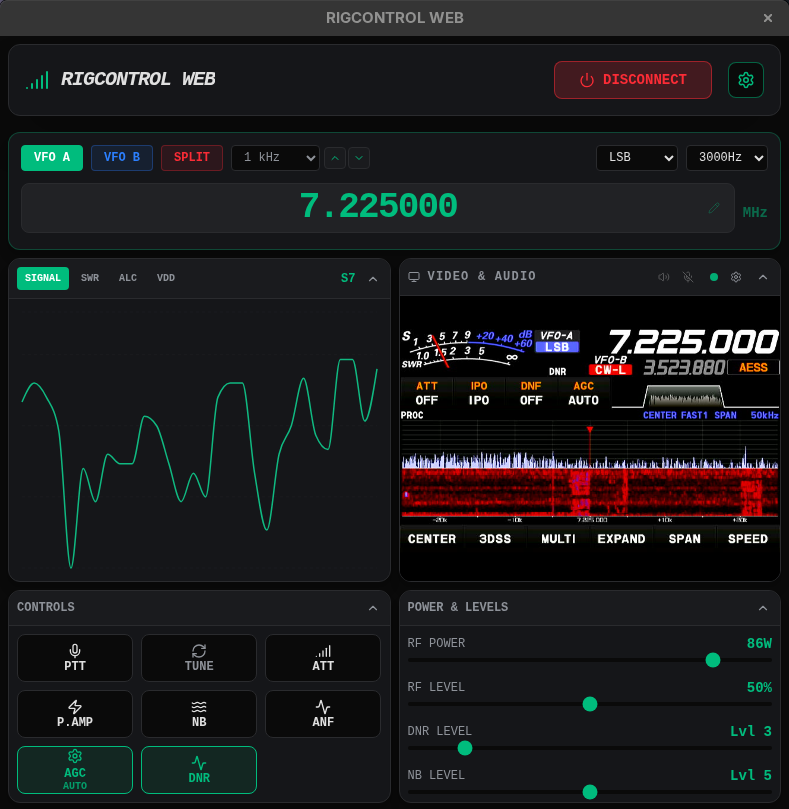
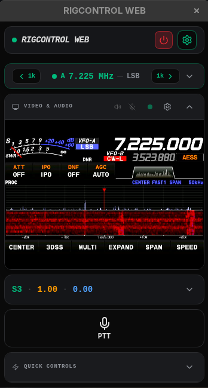

# RigControl Web

A web-first Electron app for controlling your radio via a Hamlib rigctld network which also includes bidirectional audio for making SSB contacts, and video support so you can see the front panel of your radio.  Audio via your radio's virtual USB Audio Device, Digirig or similar.  Video feeding your radio's video output back into your computer with a USB to HDMI adapter (or any old webcam pointed at it).

## Screenshots

### Compact View (Desktop)


### Phone View (Mobile)


## Features

- **Real-time Dashboard**: Frequency, mode, and meter displays (S-Meter, SWR, ALC, Power, VDD) polled live from the rig.
- **Bidirectional Audio**: Full transmit and receive audio over the network using the Opus 1.5 codec. Works for remote SSB, AM, and FM contacts. Powered by native `naudiodon` I/O and `libopus-node`.
  - Multi-client support.
  - Audio device lists show the host API (MME, DirectSound, WASAPI, ALSA, Pipewire/PulseAudio) and native sample rate so you can pick the right entry for your hardware.
  - **Rig Video Feed**: Display a system video capture device (e.g. HDMI capture card or webcam) so you can see your radio's front panel remotely. Example: FT-710 DVI out → USB HDMI capture card.
- **POTA Spots**: Live Parks on the Air spot display, pulled directly from the POTA API at a configurable poll interval.
  - Deduplicated per activator — only the latest spot per callsign is shown.
  - Filterable by mode (SSB, CW, FT8, FT4) and band (160M through 440, multi-select).
  - Configurable maximum spot age (1–15 minutes).
  - Sortable columns (activator, frequency, mode, location, age) with ascending/descending/API-order cycle.
  - Click any frequency to instantly tune the VFO and set the mode. SSB spots auto-resolve to USB or LSB based on the 10 MHz boundary.
  - Layout-aware: inline box below Quick Controls (phone), slide-in drawer via header button (compact), inline box below Video & Audio (desktop).
- **Phone View**: Dedicated portrait-optimized layout for operating from a phone or tablet.
- **Split VFO Support**: Full control over split operations with visual feedback.
- **Works With All Hamlib-Compatible Software**: Configure your logging app or other Hamlib enabled application to use "Hamlib NET rigctl" at `127.0.0.1:4532`.
  - WSJT-X, WSJT-X Improved, FLDigi, VarAC, JS8Call, and more.
  - This means not having to split serial ports to use multiple apps.
- **Remote Access**: Access your shack from anywhere over your own VPN by pointing a browser to your rig computer's IP on port 3000.
  - The server runs over **HTTPS** using an auto-generated self-signed certificate (EC P-256, 1-year validity). The certificate is regenerated automatically if it expires within 30 days or if the machine's LAN IP changes.
  - On first launch, your browser will show a certificate warning. Accept the exception once — all browsers remember it per origin.
  - Audio (WebRTC `getUserMedia`, `setSinkId`) requires a secure context (HTTPS or localhost). The built-in HTTPS server satisfies this requirement without needing a reverse proxy for LAN use.
  - IMPORTANT: For access outside your LAN (internet/VPN), a reverse proxy with a trusted certificate is still recommended.

## TODO

- **Remote CW**: CW keying from a phone, tablet, or laptop while away from home.
- **macOS Support**: Currently untested — requires externally installed Hamlib 4.7.0 in the system PATH.
- **Broader Rig Testing**: Currently tested on FT-710 only, which means other similar modern Yaesu radios should work well. Other Hamlib-supported rigs should work.  Let me know with a bug report.

## Prerequisites

### Common
- **Operating Systems**:
  - **Windows 10 or higher** (tested on Windows 11 23H2) — Requires Hamlib 4.7.0 or later installed.
    - For audio, use MME or DirectSound devices from the backend audio device selector. WASAPI requires the Windows audio device to be configured at 48 kHz in Sound settings (for example, FT-710 only works at 44,100).
  - **Linux kernel 6.0 or higher** (tested on Fedora 43) — Bundled with latest daily Hamlib snapshot.  Hamlib install not required.
  - **macOS** (TBA — no test hardware available)
    - Requires externally installed Hamlib 4.7.0 in the system PATH.

### Compile from Source
- **Node.js**: Version 18 or higher.
- **Hamlib**: 4.7.0 or higher.
  - **Electron Apps**: Bundle `rigctld` by placing the binary in `bin/[linux|windows|mac]/`.  Not required.  Will fall back to system Hamlib binaries.

### Installing Hamlib (if required)
- **Linux**: `sudo apt install libhamlib-utils`
- **macOS**: `brew install hamlib`
- **Windows**: Download and install from the [Hamlib website](https://hamlib.github.io/).

## Development

1. Install dependencies:
   ```bash
   npm install
   ```
2. Start the web server in development mode:
   ```bash
   npm run dev
   ```
3. Open [http://localhost:3000](http://localhost:3000) in your browser.

## Desktop App (Electron)

RigControl Web can be run as a native desktop application. The backend Express server runs silently in the background and the frontend is displayed in a native window. Audio hardware is released cleanly when the app exits.

### Run in Development
```bash
npm run electron:dev
```

### Build for Production

#### Windows (NSIS Installer)
```bash
npm run electron:build -- --win
```

#### Linux (AppImage)
```bash
npm run electron:build -- --linux
```

#### macOS (DMG Installer)
```bash
npm run electron:build -- --mac
```

Built installers are placed in the `build/` directory.

### Launching the Installed App
Once installed, launch "RigControl Web" from your applications menu or desktop shortcut. The application will:
1. Start the background Express server.
2. Open the UI — configure your rig settings and start `rigctld` from the Settings panel.

### Verbose Logging
By default the app runs quietly — only errors and key status messages are printed. To enable full diagnostic output (audio pipeline details, video frame relay, Hamlib capability detection, etc.), launch with the `-v` flag:

**Windows:**
```
"RigControl Web.exe" -v
```
**Linux:**
```
rigcontrol-web -v
```
**Development:**
```
npm run dev -- -v
```
The verbose flag is also forwarded to connected browser clients, which will print matching diagnostic output to their DevTools console.

## Configuration

Open the **General Settings** panel (gear icon) to configure. Settings are organized into tabs:

### RIGCTLD Tab
- **Rig Number**: Hamlib model ID for your radio.
- **Serial Port**: Device path (e.g. `/dev/ttyUSB0` or `COM3`).
- **Baud Rate**: Serial speed for your radio.
- **Network Settings**: Host and port for the `rigctld` server.
- **Video Settings**: Capture device selection and stream quality.
- **Audio Settings**: Backend input/output device (server-side, for the radio), local input/output device (browser-side, for the operator), and enable/disable inbound and outbound audio independently.

### SPOTS Tab
- **POTA**: Enable/disable live Parks on the Air spot display.
  - **Poll Frequency**: How often to fetch from the POTA API (1–5 minutes).
  - **Max Spot Age**: Discard spots older than this threshold (1, 3, 5, 10, or 15 minutes).
  - **Band Filter**: Multi-select checkbox grid to limit spots to specific bands (6M through 440). No selection = all bands shown.
  - **Mode Filter**: Limit spots to a single mode — SSB, CW, FT8, FT4, or ALL.

## License

Apache-2.0. See [LICENSE.md](LICENSE.md) for the full license text and third-party dependency licenses.
