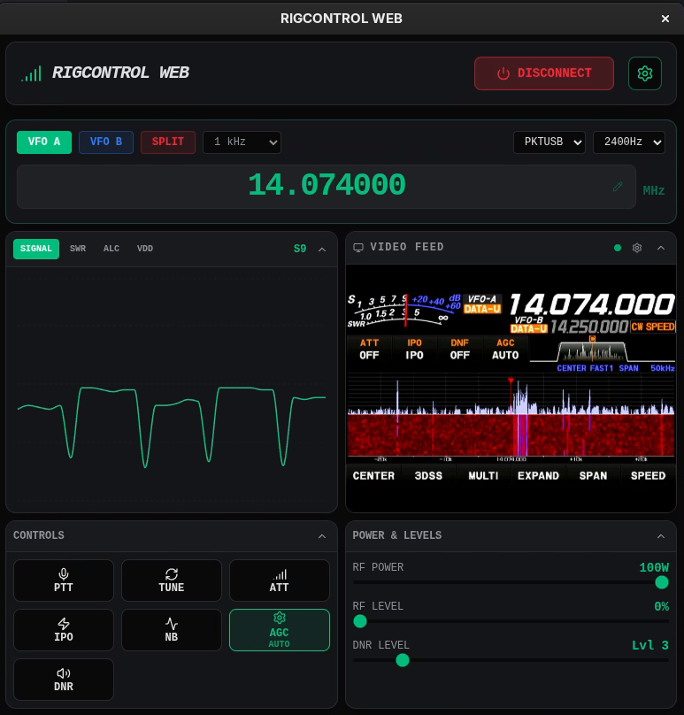

# RigControl Web


A modern, full-stack web application and desktop client designed to control amateur radio equipment via Hamlib's `rigctld`. It features a real-time dashboard with frequency, mode, and meter displays, and can automatically manage a local `rigctld` process.

## Features

- **Real-time Dashboard**: Frequency, mode, and meter displays (S-Meter, SWR, ALC, Power, VDD).
- **Process Management**: Automatically start and stop `rigctld` from the web interface.
- **Split VFO Support**: Full control over split operations with visual feedback.
- **Desktop App**: Can be built as a native application for Windows, Linux, and macOS.
- **Rig Video Feed**: Displays a system video capture device, like an HDMI capture card or a webcam, so you can see your radio's front screen.  Example: FT-710 DVI out > USB to HDMI capture card.
- **Mobile Rig Control**: Through your own VPN and installing the app or pointing your VPN'd browser to your rig computer IP on port 3000.
- **Works With All Hamlib Supported Apps**: Tell your app that your rig is a "Hamlib NET rigctl" with a local address of 127.0.0.1:4532.

## TODO
- **Audio In/Out**: Full audio in/out support for compatible rigs.  You can do remote SSB contacts!
- **Bundle Hamlib**: So Hamlib doesn't need to be preinstalled on your system.
- **Testing of All Popular Rigs**: Very limited testing, currently FT-710, 991A, DX10, 101D, 101MP should work fine.

## Prerequisites

- **Node.js**: Version 18 or higher. (if compiling)
- **Hamlib**: `rigctld` must be installed on your system and available in the system PATH.
  - **Linux**: `sudo apt install libhamlib-utils`
  - **macOS**: `brew install hamlib`
  - **Windows**: Download and install from the [Hamlib website](https://hamlib.github.io/).

## Development

1. Install dependencies:
   ```bash
   npm install
   ```
2. Start the web server in development mode:
   ```bash
   npm run dev
   ```
3. Open [http://localhost:3000](http://localhost:3000) in your browser.

## Desktop App (Electron)

RigControl Web can be run as a native desktop application. In this mode, the backend server runs silently in the background, and the frontend is displayed in a native window.

### Run in Development
To launch the Electron app in development mode:
```bash
npm run electron:dev
```

### Build for Production
You can create installers for your specific platform using the following commands:

#### Windows (NSIS Installer)
```bash
npm run electron:build -- --win
```

#### Linux (AppImage)
```bash
npm run electron:build -- --linux
```

#### macOS (DMG Installer)
```bash
npm run electron:build -- --mac
```

The built installers will be located in the `build/` directory.

### Launching the Installed App
Once installed, simply launch "RigControl Web" from your applications menu or desktop shortcut. The application will:
1. Start the background Express server.
2. Launch the `rigctld` process from the settings menu after entering all required settings.

## Configuration

Access the **Settings** (gear icon) in the application to configure:
- **Rig Number**: The Hamlib model ID for your radio.
- **Serial Port**: The device path (e.g., `/dev/ttyUSB0` or `COM3`).
- **Baud Rate**: The serial speed for your radio.
- **Network Settings**: The host and port for the `rigctld` server.
- **Auto Start**: Enable this to have the app manage the `rigctld` process for you.

## License

MIT
