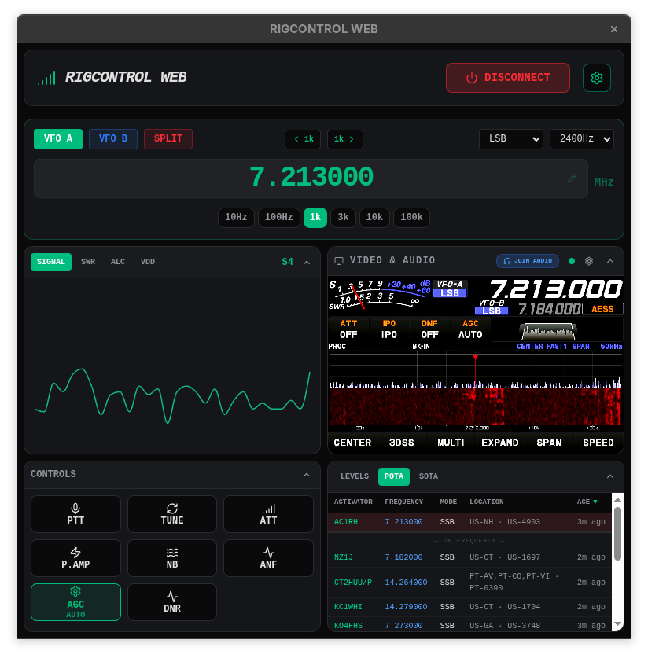
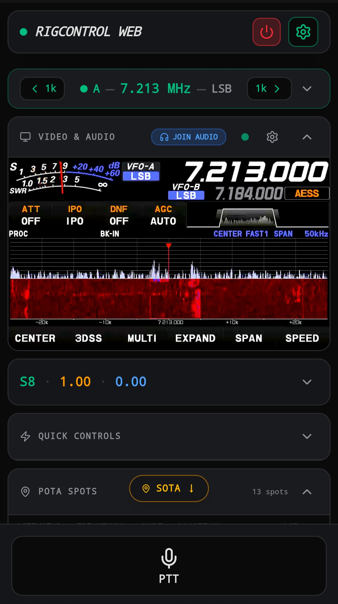

# RigControl Web

A web-first app for controlling your radio and making CW and SSB contacts!  Full support for making voice and CW contacts with built-in audio, built-in CW keyer in iambic and straight modes (via keyboard or "vBand adapter"), and video support so you can see the front panel of your radio.  Audio via your radio's virtual USB Audio Device, Digirig or similar.  Video feeding your radio's video output back into your computer with a USB to HDMI adapter (or any old webcam pointed at it).

## Getting Started

**Most users should download the latest pre-built installer from the [Releases page](https://github.com/jbdubbs/Rig-Control-Web/releases).** Pick the installer for your operating system (Windows `.exe`, Linux `.AppImage`, or macOS `.dmg`), run it, and you are ready to go — no Node.js, no build tools required.

> **macOS users:** The `.dmg` is unsigned (no Apple Developer ID certificate). macOS Gatekeeper will block it on first launch. To open it: right-click (or Control-click) the app in Finder and choose **Open**, then click **Open** in the dialog. You only need to do this once.

For full usage instructions, see the **[Wiki](https://github.com/jbdubbs/Rig-Control-Web/wiki)**.

Developers who want to run from source will find build instructions in the [Development](#development) and [Desktop App (Electron)](#desktop-app-electron) sections below.

## Screenshots

### Compact View (Desktop)


### Phone View (Mobile)


## Features

- **Real-time Dashboard**: Frequency, mode, and meter displays (S-Meter, SWR, ALC, Power, VDD) polled live from the rig.
- **Bidirectional Audio**: Full transmit and receive audio over the network using the Opus 1.5 codec. Works for remote SSB, AM, and FM contacts. Powered by native `naudiodon` I/O and `libopus-node`.
  - Multi-client support.
  - Audio device lists show the host API (MME, DirectSound, WASAPI, ALSA, Pipewire/PulseAudio) and native sample rate so you can pick the right entry for your hardware.
  - **Rig Video Feed**: Display a system video capture device (e.g. HDMI capture card or webcam) so you can see your radio's front panel remotely. Example: FT-710 DVI out → USB HDMI capture card.
- **CW Keyer**: Full iambic (A/B) and straight-key CW keying from any browser or the Electron app.
  - Configurable WPM, keying method (DTR, RTS, or rigctld-PTT), serial port, and iambic mode.
  - Rebindable keyboard keys. Instant local sidetone via Web Audio — no latency from the network.
  - On phone/tablet, dedicated dit (·) and dah (—) touch paddle buttons replace the PTT bar when the rig is in CW mode.
- **Live Spots (POTA & SOTA)**: Real-time spot displays for Parks on the Air and Summits on the Air, each independently enable/disable with configurable poll intervals.
  - Filterable by mode (SSB, CW, FT8, FT4) and band (multi-select). Configurable maximum spot age.
  - Sortable columns. Click any spot to instantly tune the VFO and set the mode. SSB spots auto-resolve to USB or LSB based on the 10 MHz boundary.
  - Layout-aware: inline below Quick Controls (phone), slide-in drawer via header button (compact), inline below Video & Audio (desktop).
- **Phone View**: Dedicated portrait-optimized layout for operating from a phone or tablet.
- **Split VFO Support**: Full control over split operations with visual feedback.
- **Works With All Hamlib-Compatible Software**: Configure your logging app or other Hamlib enabled application to use "Hamlib NET rigctl" at `127.0.0.1:4532`.
  - WSJT-X, WSJT-X Improved, FLDigi, VarAC, JS8Call, and more.
  - This means not having to split serial ports to use multiple apps.
- **Remote Access**: Access your shack from anywhere over your own VPN by pointing a browser to your rig computer's IP on port 3000. (e.g. https://192.168.1.2:3000)
  - The server runs over **HTTPS** using an auto-generated self-signed certificate. The certificate is regenerated automatically if it expires within 30 days or if the machine's LAN IP changes.
  - On first launch, your browser will show a certificate warning. Navigate to Advanced.... then proceed to the site anyway.
  - Audio capabilities require HTTPS. The built-in HTTPS server satisfies this requirement without needing a reverse proxy for LAN use.
  - IMPORTANT: For access outside your LAN (internet/VPN), a reverse proxy with a trusted certificate is still recommended.  Setting up a reverse proxy is beyond the scope of this project.

## TODO

- **macOS Support**: Currently untested — requires externally installed Hamlib 4.7.0 in the system PATH.
- **Broader Rig Testing**: Currently tested on FT-710 and FT-891, which means other similar modern Yaesu radios should work well. Other Hamlib-supported rigs should work.  Let me know with a bug report.

## Prerequisites

### Common
- **Operating Systems**:
  - **Windows 10 or higher** (tested on Windows 11 23H2) — Requires Hamlib 4.7.0 or later installed.
    - For audio, use MME or DirectSound devices from the backend audio device selector. WASAPI requires the Windows audio device to be configured at 48 kHz in Sound settings (for example, FT-710 only works at 44,100).
  - **Linux kernel 6.0 or higher** (tested on Fedora 43) — Bundled with latest daily Hamlib snapshot.  Hamlib install not required.
  - **macOS** (TBA — no test hardware available)
    - Requires externally installed Hamlib 4.7.0 in the system PATH.

### Compile from Source
- **Node.js**: Version 18 or higher.
- **Hamlib**: 4.7.0 or higher.
  - **Electron Apps**: Bundle `rigctld` by placing the binary in `bin/[linux|windows|mac]/`.  Not required.  Will fall back to system Hamlib binaries.

### Installing Hamlib (if required)
- **Linux**: `sudo apt install libhamlib-utils`
- **macOS**: `brew install hamlib`
- **Windows**: Download and install from the [Hamlib website](https://hamlib.github.io/).

## Development

1. Install dependencies:
   ```bash
   npm install
   ```
2. Start the web server in development mode:
   ```bash
   npm run dev
   ```
3. Open [http://localhost:3000](http://localhost:3000) in your browser.

## Desktop App (Electron)

RigControl Web can be run as a native desktop application. The backend Express server runs silently in the background and the frontend is displayed in a native window. Audio hardware is released cleanly when the app exits.

### Run in Development
```bash
npm run electron:dev
```

### Build for Production

#### Windows (NSIS Installer)
```bash
npm run electron:build -- --win
```

#### Linux (AppImage)
```bash
npm run electron:build -- --linux
```

#### macOS (DMG Installer, arm64)
```bash
npm run electron:build -- --mac --arm64
```

> The resulting `.dmg` is **unsigned**. On first launch, right-click the app in Finder → **Open** → **Open** to bypass Gatekeeper.

Built installers are placed in the `build/` directory.

### Linux GNOME Desktop Integration (AppImage)

The AppImage is portable and does not register with your desktop environment by default. To add RigControl Web to your GNOME application menu with the correct icon and taskbar association, run the AppImage once with `--install`:

```bash
./RigControl-Web-<version>.AppImage --install
```

This copies the app icon to `~/.local/share/icons/` and writes a `.desktop` entry to `~/.local/share/applications/`. The AppImage itself is not moved — keep it wherever you like.

To remove the desktop integration:

```bash
./RigControl-Web-<version>.AppImage --uninstall
```

### Launching the Installed App
Once installed, launch "RigControl Web" from your applications menu or desktop shortcut. The application will:
1. Start the background Express server.
2. Open the UI — configure your rig settings and start `rigctld` from the Settings panel.

### Verbose Logging
By default the app runs quietly — only errors and key status messages are printed. To enable full diagnostic output (audio pipeline details, video frame relay, Hamlib capability detection, etc.), launch with the `-v` flag:

**Windows:**
```
"RigControl Web.exe" -v
```
**Linux:**
```
rigcontrol-web -v
```
**Development:**
```
npm run dev -- -v
```
The verbose flag is also forwarded to connected browser clients, which will print matching diagnostic output to their DevTools console.

## Configuration

Open the **General Settings** panel (gear icon) to configure. Settings are organized into tabs:

### RIGCTLD Tab
- **Rig Number**: Hamlib model ID for your radio.
- **Serial Port**: Device path (e.g. `/dev/ttyUSB0` or `COM3`).
- **Baud Rate**: Serial speed for your radio.
- **Network Settings**: Host and port for the `rigctld` server.
- **Video Settings**: Capture device selection and stream quality.
- **Audio Settings**: Backend input/output device (server-side, for the radio), local input/output device (browser-side, for the operator), and enable/disable inbound and outbound audio independently.
  - **Local Speaker Volume**: A slider (0–200%) below the Local Output dropdown controls the volume of received audio in your browser. 100% is unity gain (system volume unchanged). Above 100% amplifies the signal — useful when your system volume is already at maximum.

### KEYER Tab
Configure the CW keyer:
- **Enable CW Keyer**: Activates keyboard keying and sidetone. The keyer becomes active as soon as the rig is connected — no audio session required.
- **Keying Method**: How the key output is delivered — **DTR** (default), **RTS**, or **CAT PTT** (uses the rig's PTT line via Hamlib — last resort; most radios process CAT commands too slowly for clean CW timing).
- **Serial Port**: The port the keyer interface is connected to (may differ from the rig's control port).
- **Key Mode**: **Iambic A**, **Iambic B**, or **Straight Key**.
- **Speed (WPM)**: Words per minute — adjustable 5–40 WPM.
- **Sidetone**: Enable/disable local audio feedback, set tone frequency (Hz), and volume. The sidetone plays instantly in the browser — it does not travel through the radio.
- **Key Bindings**: Rebind the dit, dah, and straight key keyboard keys. Click the binding and press any key to rebind.

### SPOTS Tab
Enable POTA and/or SOTA spot displays independently. Each has identical controls:
- **Poll Frequency**: How often to fetch new spots (1–5 minutes).
- **Max Spot Age**: Discard spots older than this threshold.
- **Band Filter**: Multi-select checkbox grid. No selection = all bands shown.
- **Mode Filter**: Limit spots to SSB, CW, FT8, FT4, or ALL.

## License

Apache-2.0. See [LICENSE.md](LICENSE.md) for the full license text and third-party dependency licenses.
