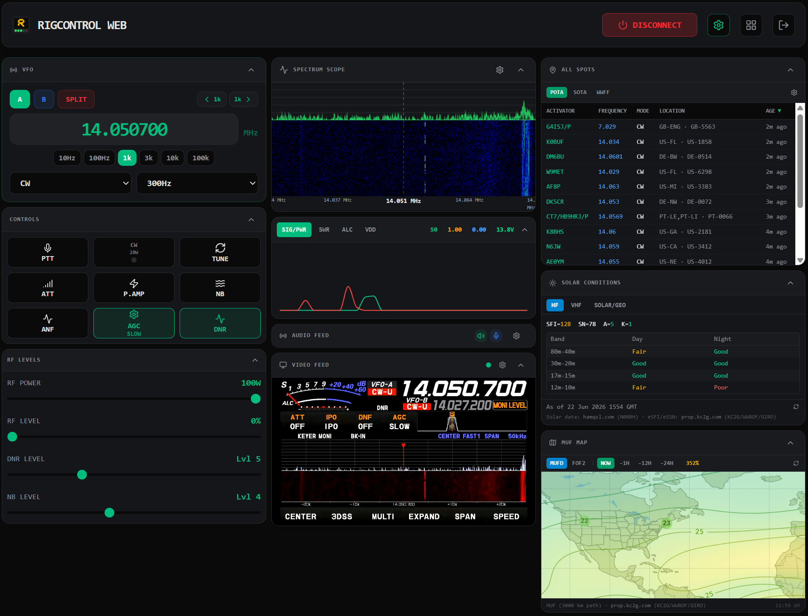

# RigControl Web

Make your regular 'ole rig just like your buddy's $6000 Flex.  Completely free and open source.  

- **Remote Voice**
  - Use your laptop or phone mic
  - Low latency, high fidelity audio
- **Remote CW**
  - Hardware paddle (vband or TinyMidi), keyboard, or touch keying
  - CW decoder
  - Work manually keyed CW from your phone!
- **Remote Digital**
  - Use the full WSJTX app on your remote computer from anywhere.  Just grab the helper app.
  - Can be used with any Hamlib compatible app like JS8Call, Fldigi, QSSTV, etc.
- **Spectrum Scope**
  - ICOM Rigs (7300, 705, 7610, etc)
  - Yaesu FT-710
  - Xiegu G90
- **Front Panel Video Feed**
  - ​​​For radios with DVI/HDMI out
- **Full Remote Radio Control**
  - Any Hamlib supported rig
  - All Hamlib-compatible apps can connect through app so you still get all the control features.
- **POTA/SOTA/WWFF/DX Spots**
  - Auto-QSY on click
  - Filter by mode and band
- **FT8 Decoder**
  - A just OK FT8 decoder for show-and-tell purposes.
  - Use it at club recruiting events to show reception of signals from "around the world".
  - Check the band before you fire up the whole FT8 stack (WSJTX, Gridtracker, etc).
- **​HF Conditions Info**
  - ​​​Zoomable MUF and Fof2 Maps
  - Solar conditions from hamqsl.com and prop.kc2g.com
- **Configurable Panel Interface**
  - Add/remove any panel you wish.  Make it large enough for a 4k display, or small enough for an old VGA monitor.
  - Mobile phone view for iOS and Android.
- **​​​​​​​User Auth System**
  - Use it at your club and give each licensed amateur their own login!
  
## Getting Started

**Most users should download the latest pre-built installer from the [Releases page](https://github.com/jbdubbs/Rig-Control-Web/releases).** Pick the installer for your operating system (Windows `.exe`, Linux `.AppImage`, or macOS `.dmg`), run it, and you are ready to go.

**Running on a dedicated Raspberry Pi (coming soon) or mini PC?** See [Headless Deployment](https://github.com/jbdubbs/Rig-Control-Web/wiki/Headless-Deployment) for Docker Compose, `docker run`, and systemd options.

For full usage instructions, see the **[Wiki](https://github.com/jbdubbs/Rig-Control-Web/wiki)**.

## Screenshots

### Compact View (Desktop)


### Phone View (Mobile)


## Prerequisites

### Common
- **Operating Systems**:
  - **Windows 10 or higher** (tested on Windows 11 23H2) — The Electron installer includes a bundled `rigctld`.
  - **Linux kernel 6.0 or higher** (tested on Fedora 43) — The Electron AppImage includes a bundled `rigctld`.
  - **macOS** — Completely untested.  No testing hardware.  Try it out and submit a report.

### Compile from Source
- **Node.js**: Version 24 or higher.
- **Hamlib**: 4.7.0 or higher.
  - **Electron Apps**: A bundled `rigctld` is auto-provisioned at build time by `scripts/build-rigctld.mjs` (runs as part of `npm run electron:build`). It will skip the build if a binary is already present in `bin/[linux|windows|mac]/`. The app falls back to the system `rigctld` if no bundled binary is found.

### Installing Hamlib (only if compiling from source, 4.7.0 or higher)
- **Linux**: `sudo apt install libhamlib-utils`, `sudo dnf install hamlib`
  - **WARNING**: Most Linux distros, including extremely modern ones seem to still be bundling Hamlib 4.6.5 (as of May 2026).  This will NOT work.  Install from the Hamlib GitHub page. [Hamlib website](https://hamlib.github.io/)
- **macOS**: `brew install hamlib`
- **Windows**: Download and install from the [Hamlib website](https://hamlib.github.io/).

## Development

1. Install dependencies:
   ```bash
   npm install
   ```
2. Start the web server in development mode:
   ```bash
   npm run dev
   ```
3. Open [https://localhost:3000](https://localhost:3000) in your browser.

### Desktop App (Electron)

RigControl Web can be run as a native desktop application.

#### Run in Development
```bash
npm run electron:dev
```

#### Build for Production

##### Windows (NSIS Installer)
```bash
npm run electron:build -- --win
```

##### Linux (AppImage)
```bash
npm run electron:build -- --linux
```

###### Linux GNOME Desktop Integration (AppImage)

To add RigControl Web to your GNOME application menu with the correct icon and taskbar association, run the AppImage once with `--install`:

```bash
./RigControl-Web-<version>.AppImage --install
```

This copies the app icon to `~/.local/share/icons/` and writes a `.desktop` entry to `~/.local/share/applications/`. The AppImage itself is not moved — keep it wherever you like.

To remove the desktop integration:

```bash
./RigControl-Web-<version>.AppImage --uninstall
```

##### macOS (DMG Installer, arm64)
```bash
npm run electron:build -- --mac --arm64
```

Built installers are placed in the `build/` directory.

### Diagnostic Logging

See the [Diagnostic Logging wiki page](https://github.com/jbdubbs/Rig-Control-Web/wiki/Diagnostic-Logging) for `--debug-*` flags and how to capture logs for a bug report.

## License

Apache-2.0. See [LICENSE.md](LICENSE.md) for the full license text and third-party dependency licenses.
